# Ashley Smith and Jordon Goodsir - T3A2

Santa Site

- [Part A - Docs - Repo](https://github.com/MERN-Project-Santa/Part-A-Docs)
- [Part B - Client - Repo](https://github.com/MERN-Project-Santa/Client)
- [Part A - Server - Repo](https://github.com/MERN-Project-Santa/Server)
- [Deployed Front End](https://north-pole-post.netlify.app/)
- [Deployed Back End](https://north-pole-post-backend.herokuapp.com/)

## Authors

Ashley Smith - [GitHub](https://github.com/Ash-Eileen) | [Portfolio](https://ashleysmith.netlify.app/) | [Twitter](https://twitter.com/Ash413_) | [LinkedIn](https://www.linkedin.com/in/ash-eileen/)

Jordon Goodsir - [GitHub](https://github.com/JordonGoodsir) | [Portfolio](https://jordongoodsir.netlify.app/) | [Twitter](https://twitter.com/GoodsirDev) | [LinkedIn](https://www.linkedin.com/in/jordon-goodsir-61466a1a5/)

## Table of Contents

- [Description](https://github.com/MERN-Project-Santa/Server#description)
- [Purpose](https://github.com/MERN-Project-Santa/Server#purpose)
- [Functionality/Features](https://github.com/MERN-Project-Santa/Server#functionality--features)
- [Target Audience](https://github.com/MERN-Project-Santa/Server#target-audience)
- [Tech Stack](https://github.com/MERN-Project-Santa/Server#tech-stack)
- [Dataflow Diagram](https://github.com/MERN-Project-Santa/Server#dataflow-diagram)
- [Application Architecture](https://github.com/MERN-Project-Santa/Server#application-architecture-diagram)
- [User Stories](https://github.com/MERN-Project-Santa/Server#user-stories)
- [Wireframes](https://github.com/MERN-Project-Santa/Server#wireframes)
- [Trello Board](https://github.com/MERN-Project-Santa/Server#trello-board)
- [Planning Methodology](https://github.com/MERN-Project-Santa/Server#planning-methodology)
- [Implemented Application](https://github.com/MERN-Project-Santa/Server#implemented-application)
- [Libraries and Dependencies](https://github.com/MERN-Project-Santa/Server#libraries-and-dependencies)
- [Project Management and Task Delegation Methodology](https://github.com/MERN-Project-Santa/Server#project-managment-and-task-delegation-methodology)
- [Testing](https://github.com/MERN-Project-Santa/Server#testing)

## Description

### Purpose

There are three main purposes of this project: save the environment, save labor and entertain. Saving the environment through going as close to paperless on gift lists, letters to Santa and advent calendars as possible. Saving labour for our client (Santa and the elves) through collecting users present data that can be used to create gifts in the North Pole with more accuracy. Lastly to entertain the user with various activities, thereby making them more likely to come back to the site.

### Functionality / features

- Advent Calender (normal)
- Advent Calender (game)
- Letter to Santa
- Secret Santa
- Gift List
- Countdown to Christmas

### Target Audience

There are three main audiences we are targetting: parents, children and groups that are taking part in a secret santa. Parents are targetted to use the letter to Santa feature so they can manage the gift lists of their children in a festive way. Children are targeted to be entertained by the numerous activities as well as the letter to Santa after being set up by their parent. Lastly, groups are targeted to utilize the secret santa option as a means to save money as they do not have to buy a gift for everyone, but increase the cost and quality of one gift given to the randomly chosen recipient.

### Tech Stack

#### **Front-end**

- HTML
- JavaScript
- CSS
- [React](https://reactjs.org/)

#### **Back-end**

- [Express](https://expressjs.com/)
- [Node.js](https://nodejs.org/en/)

#### **Database**

- [MongoDB](https://www.mongodb.com/)
- [Mongoose](https://mongoosejs.com/)

#### **Deployment**

- [Heroku](https://www.heroku.com/)
- [Netlify](https://www.netlify.com/)

#### **Project Management Tools**

- [Trello](https://trello.com/)
- [Discord](https://discord.com/)

#### **Testing**

- [Cypress](https://www.cypress.io/)
- [Mocha](https://mochajs.org/)

#### **DevOps Tools**

- [git](https://git-scm.com/)
- [GitHub](https://github.com/)
- [Visual Studio Code](https://code.visualstudio.com/)

#### Design Tools

- [Figma](https://www.figma.com/)
- [diagrams.net](https://app.diagrams.net/)
- [Xtensio](https://xtensio.com/)

## Dataflow Diagram

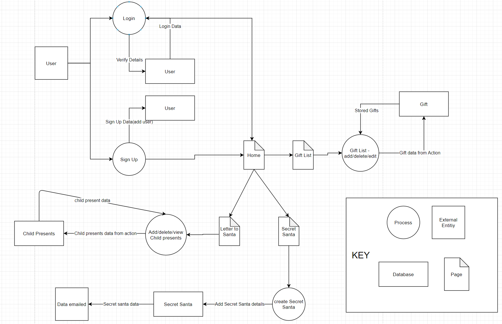

## Application Architecture Diagram

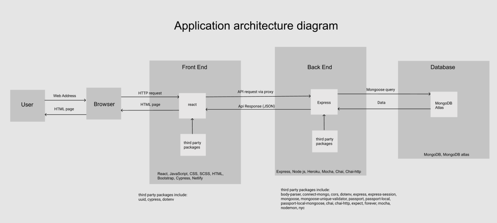

## User Stories

### **Stage One** - User Stories

<strong>Child</strong>

- As a child I want to be able to create a list of gifts I want from Santa.
- As a child I want to be able to write a letter to Santa.
- As a child I want to be able to change my list by adding or removing items.

<strong>Parent</strong>

- As a parent I want to be able to add my children.
- As a parent I want to be able to see my childrens gift list.
- As a parent I want to be able to mark presents as bought on my childrens gift list.
- As a parent I want my children to be able to interact with a child-friendly "letter to santa" page.
- As a parent I want to be able to still interact with the normal features of my account.

<strong>Standard User</strong>

- As a user I want to be able to have acces to a navigation bar so I can view the information I want.
- As a user I want to be able to view an about page with information about the websites purpose and goals.
- As a user I want to be able to view a countdown to Christmas page and select my timezone.
- As a user I want to be able to sign up/login and create my own account.
- As a user I want to be able to view the advent calendar.
- As a user I want to be able to interact with the gamified version of the advent calendar.

<strong>Signed In User</strong>

- As a user I want to be able to create a gift list for Christmas to track what presents I want to get.
- As a user I want to be able to delete items from my gift list.
- As a user I want to be able to mark items as purchased from my gift list.
- As a user I want to be able to create a Secret Santa group.
- As a user I want to be able to join a Secret Santa group.
- As a user I want to be able to see who I have to purchase a gift for as a Secret Santa.
- As a user I want to be able to create a wishlist that my Secret Santa can view.

### **Stage Two** - User Personas

To better understand our target audience User Personas were created so that we could learn more about the goals and needs of our users.

**User Persona - Julia Burns - Parent**:

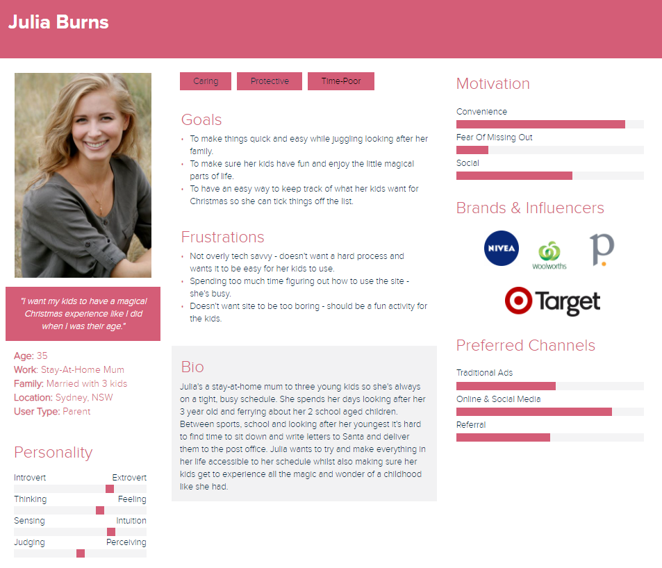

**User Persona - Will Jones - Child**:

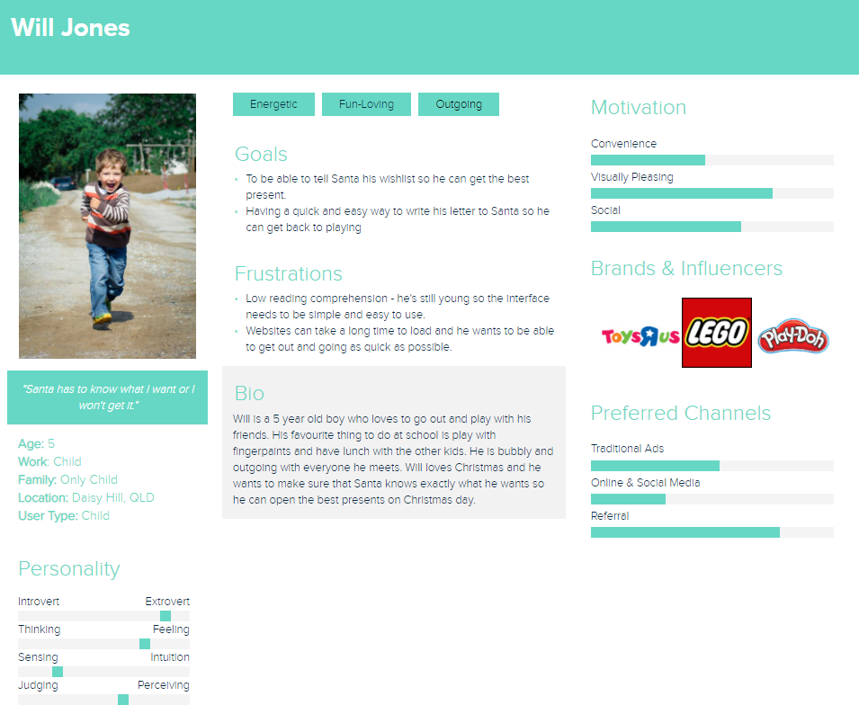

**User Persona - David Thompson - Signed In User - Secret Santa**:

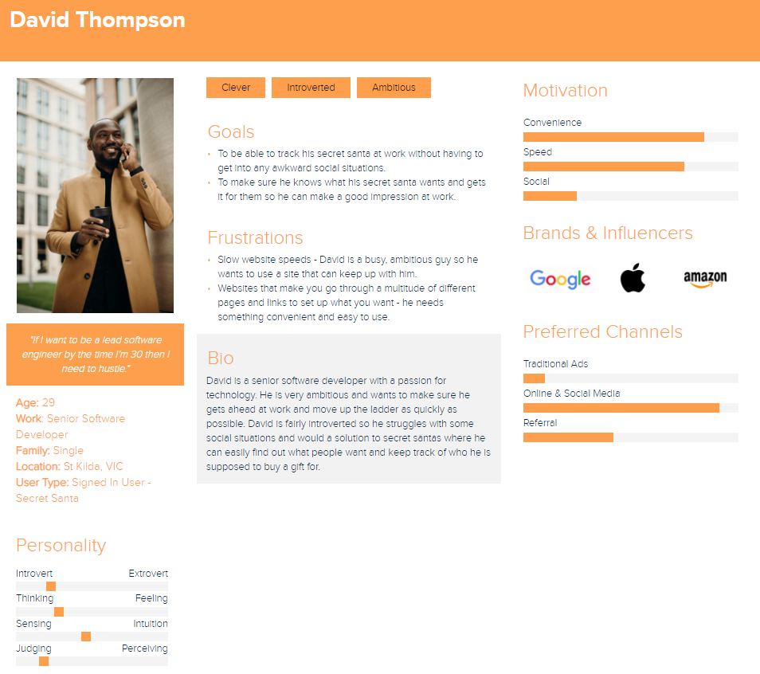

### **Stage Three** - Updated User Stories

We updated our user stories and removed some functions we were no longer including but also wanted to include the why behind each user story.

<strong>Child</strong>

- As a child I want to be able to create a list of gifts I want from Santa so I can ensure he knows what I want.
- As a child I want to be able to write a letter to Santa so Santa can read it.
- As a child I want to be able to change my list by adding or removing items so my list to kept up to date.

<strong>Parent</strong>

- As a parent I want to be able to add each of my children so everyone can use the letter to Santa.
- As a parent I want to be able to see my childrens gift list so I can get an idea of what they might get from Santa.
- As a parent I want my children to be able to interact with a child-friendly "letter to santa" page so they can use it without issue.
- As a parent I want to be able to still interact with the normal features of my account so that I can still use the other features of the site and not be restricted.

<strong>Standard User</strong>

- As a user I want to be able to have acces to a navigation bar so I can view the information I want.
- As a user I want to be able to view an about page with information about the websites purpose and goals so that I can understand why the website exist.
- As a user I want to be able to view a countdown to Christmas page and select my timezone so that the countdown is correct for me.
- As a user I want to be able to sign up/login and create my own account so that I can use the other features of the site.
- As a user I want to be able to view the advent calendar so that I can enjoy the more fun aspects of the site.
- As a user I want to be able to interact with the gamified version of the advent calendar so that I can have a more interactive experience.

<strong>Signed In User</strong>

- As a user I want to be able to create a gift list for Christmas to track what presents I want to get so that everything in one easy place.
- As a user I want to be able to delete items from my gift list so that I can remove things the receiver doesn't need or want.
- As a user I want to be able to create a Secret Santa group so that my group can participate in Secret Santa.
- As a user I want to be able to join a Secret Santa group so that I can participate with my Secret Santa group.
- As a user I want to be able to see who I have to purchase a gift for as a Secret Santa so it's easy to keep track of.
- As a user I want to be able to create a wishlist that my Secret Santa can view so they know what to get me.

<strong>Julia Burns</strong>

- I want to have a conveninient way for my kids to write their letters to Santa so that I still have plenty of time to do everything else I need to in a day.
- I want to ensure my kids get to experience the magic and fun of Christmas by writing their letters to Santa so they enjoy the fun of being a kid.
- I want to have an easy way to track what my kids want for Christmas so that I have more time to devote to my other daily tasks.

<strong>Will Jones</strong>

- I want to be able to tell Santa what I want for Christmas so I get all the toys I want.
- I want to be able to quickly write my letter to Santa so I can get back to playing and having fun.
- I want it to be easy to write my letter to Santa because I'm young and can't read much.

<strong>David Thompson</strong>

- I want to be able to track my secret santa wants because I'm introverted and want to avoid awkward social situations.
- I want to make sure I get my secret santa exactly what they want so that I can make a good impression at work.
- I want to it to be easy to look at my secrect santa details so that I can focus on more important work.

## Wireframes

### Colour Palette

For the design we wanted it to be very reminiscent of Christmas colours so we opted to go with red and white for our colour scheme. The font colour is a white colour with a slight hint of red and the background is a red with very slight hints of green and blue to ensure it is not too jarring to look at.

Background Colour: #B60D0F
Font Colour: #FBF3F3

### Typography

For the fonts we wanted to ensure readability on screen so we opted for a sans serif font for any blocks of text such as paragraphs and for headings we wanted to have an eye-catching and engaging font and chose a handwriting style font.

Headings: [Berkshire Swash](https://fonts.google.com/specimen/Berkshire+Swash?query=Berkshire+Swash&category=Handwriting)
Blocks of Text: [Karla](https://fonts.google.com/specimen/Karla?query=Karla&category=Sans+Serif)

### Figma Wireframes

The wireframes can be viewed in our Figma workspace in higher quality by going to this [link](https://www.figma.com/file/EKcUwpUCkfMpHojjCwWISm/Christmas-MERN?node-id=0%3A1).

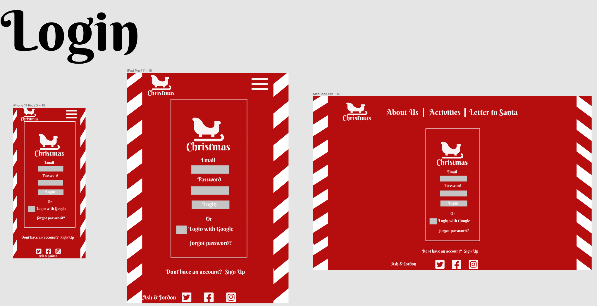

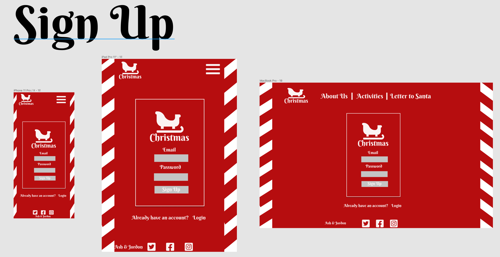

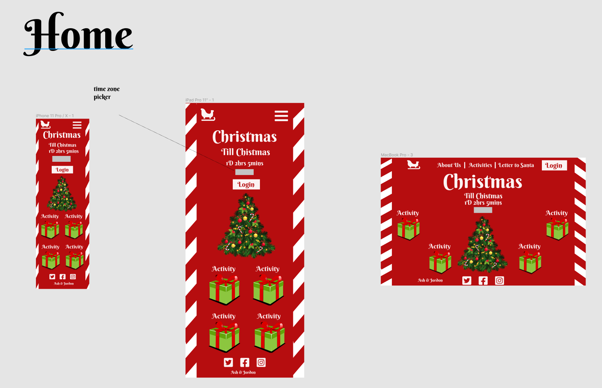

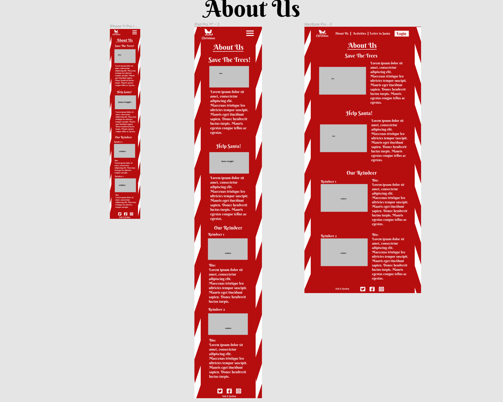

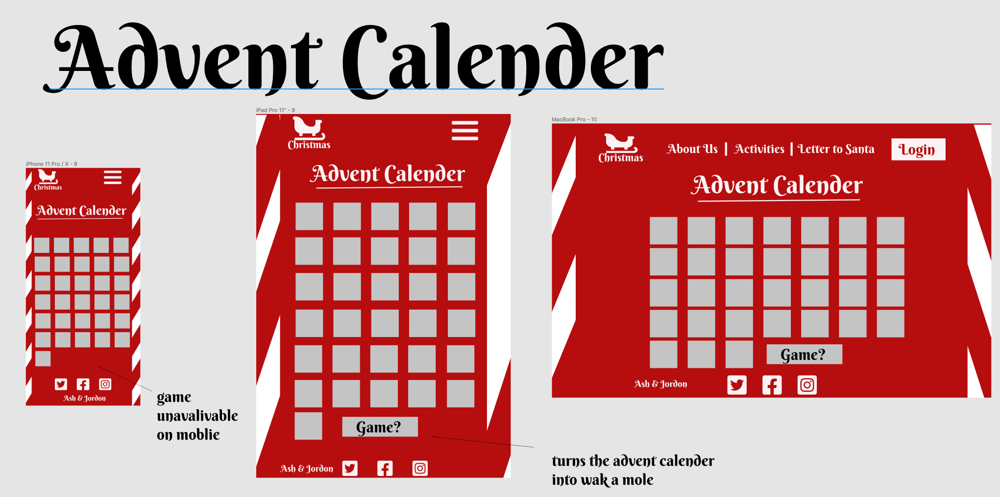

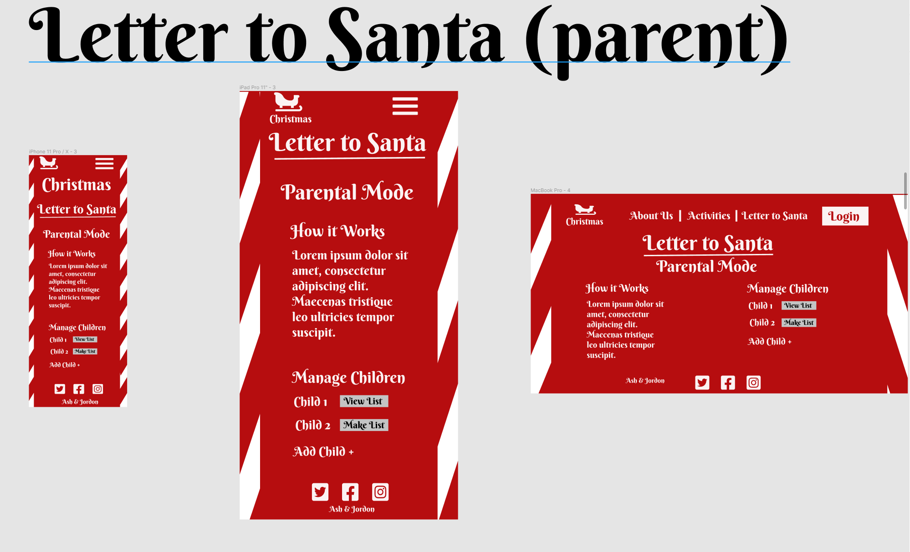

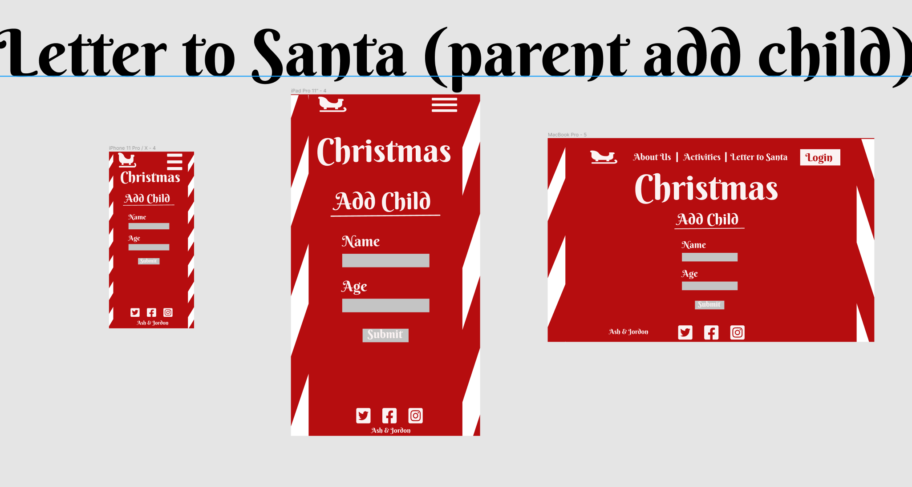

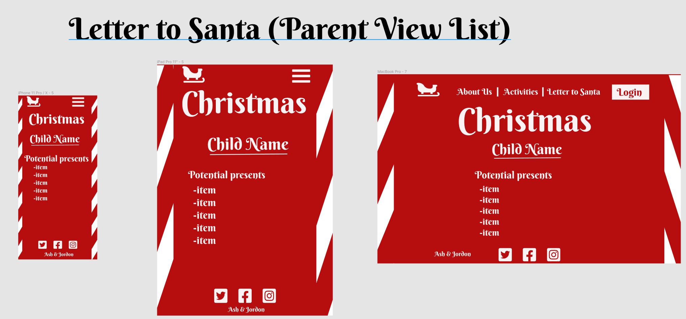

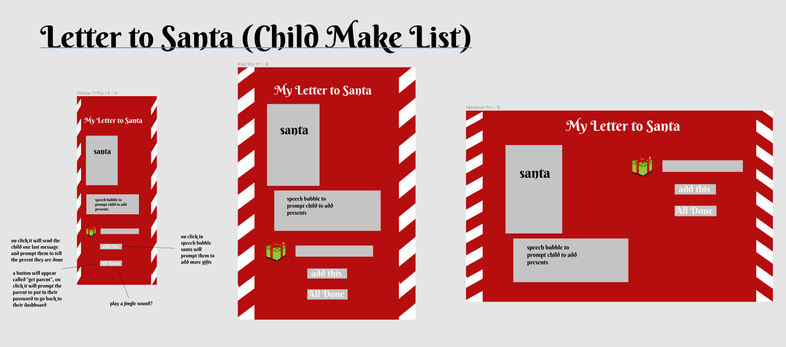

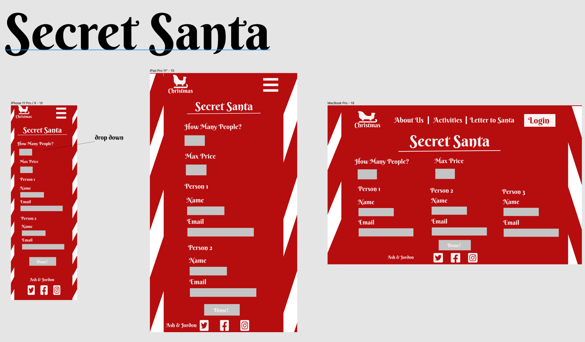

## Trello Board

Our Trello board can be viewed [here](https://trello.com/b/9TwvvbPX/full-stack-app-santa).

We took screenshots of our Trello each day at minimum in the morning and afternoon. These screenshots can be viewed [here](https://github.com/MERN-Project-Santa/Server/tree/main/docs/trello-screenshots).

## Planning Methodology

For our planning methodology we considered a couple of different options. The two main candidates were scrum and kanban for our planning. With scrum we discussed using sprints and how we would break these up, however, in the end decided this would be less efficient than going with a kanban approach. The Kanban methodology provided more flexibility, reduced the risk of bottlenecks and allowed for continuous delivery. This was achieved through the use of a digital kanban board on Trello.

## Implemented Application

The deployed application is available at [here](https://north-pole-post.netlify.app/).

At the moment the MVP features of creating an account, creating a gift list and being able to edit this gift list, adding a child and using the letter to santa function are live as well as a countdown to Christmas. Originally our MVP was to include an advent calendar and secret santa, however, after further discussion our MVP was slimmed down to the current live features. We have also cut out authorisation as a current feature. Currently authentication has been added into the site, however, due to the target demographic and MVP features it was decided that authorisation was not an MVP feature. The data that is available on this site is not personal or identifiable information on any page so this is a future goal but does not impact the usage of the site.

## Libraries & Dependencies

**Client**

- `@fortawesome/fontawesome-svg-core`, `@fortawesome/free-brands-svg-icons`, `@fortawesome/free-solid-svg-icon`, `@fortawesome/react-fontawesome`: These are used to acces the font awesome library of free icons.
- `@testing-library/jest-dom`, `@testing-library/react`, `@testing-library/user-event` and `cypress`: These are testing libaries used within the application. Tests were run using the cypress framework.
- `axios`: This library was used to make HTTP requests to the server from the client. Axios allows for the use of async and await within the code due to its promise-based nature.
- `bootstrap` and `react-bootstrap`: This allows for acces to the bootstrap library for styling and to create a responsive site more quickly and effectively.
- `node-sass`: This allows for the integration of SAAS within the client side of the application to create more readable and condensed stylesheets.
- `react`: This is the front-end framework utilised in the site. It is component based javascript library.
- `react-dom`: This libary is used in conjunction with react to bind elements to the DOM.
- `react-router-dom`: This allows for conditional rendering of compenents based on the route that has been entered. This allows for a single page application that mimics the flow of a multi-page application.
- `react-scripts`: This ships automatically with create-react-app and creates four scripts that can be run to access the app in different ways. This allows us to acces the app locally, to build the app for deployment, run tests or to remove the single build dependency from the app.
- `styled-components`: This is used as a styling tool for components within react.
- `uuid`: This has been used to create unique identifiers within arrays in react and is also passed to the server and captured in the database.

- **Server**

- `express`: Express is a minimal and flexible Node.js web application framework that runs on top of Node. This was used to create the back-end for this application and allows for HTTP utility methods and middleware support.
- `body-parser`: Body-parser is used to extract the contents of an incoming request on a route and allows it to be accessed using `req.body`. This allowed for specific requests to be made to the database based on the information sent.
- `connect-mongo`: This allows for user sessions to be created in conjunction with express-session. These are then saved in the mongo database.
- `cors`: This allows for requests from a different origin or domain to access the server. In this we implemented a whitelist to ensure the frontend deployed site and local version of the client were granted access.
- `dotenv`: Dotenv was used to allow for local variables to be defined within the application so that database keys could be safely stored.
- `express-session`: This creates user sessions and stores this information on the server in conjunction with connect-mongo. This will be used to implement authorisation in future.
- `mongoose`: Mongoose is a document-oriented database program which was used to create our schemas and handle interaction with the mongo database to retrieve and store data.
- `mongoose-unique-validator`: This package was used for validation purposes within the user schema to ensure that certain entries must be unique to that user, for example emails.
- `passport`, `passport-local` and `passport-local-mongoose`: Passport is an authentication middleware for node. We have elected to use a local strategy with passort which is why the additional packages were required.
- `chai`, `chai-http`, `expect` and `mocha`: Mocha was selected as our testing framowork for this application. We have used chai, expect and chai-http to add in an assertion library and more easily accessible testing.
- `forever`: This dev dependency is used to keep the server running continuously.

**Shared Libraries**

- `nodemon`: This dev dependency was added so that the server and client would restart when changes were made to the code.

## Project Management and Task Delegation Methodology

We chose to use discord as our main point of communication. Each morning we joined an audio call where we were able to screenshare and discuss issues immediately as they arose. This allowed for a lot of quick and simple debugging sessions where we could visually identify code issues.

We continued to use a Kanban board for task delegation. The Kanban board originally included cards for the requiremnts for Part A and Part B that would be marked, research, presentations, user stories, backlog, todo, doing, testing and completed. Eventually the cards for Part A and Part B that would be marked, research, presentations and user stories were archived as they had been completed and no longer were relevant to visually identify. We also created labels to identify how long task were expected to take and whether they were backend or frontend focussed.

Each morning we had a sprint where we could discuss our plan for the day and checkins before lunch and before the end of the day to see where we were up to and what additional help might be required. As we opted in for a Kanban approach there were no sprints but instead we worked an continuous delivery of features as they became ready.

Our trello can be accessed [here](https://trello.com/b/9TwvvbPX/full-stack-app-santa).

## Testing

Unit testing and integration tests have been written on both the client and server side of the application. These tests can be run using cypress when in the client files and mocha when in the server files.

We have also done extensive user testing ourselves as well as asking for testing to be completed by family members and friends. For our own user testing this was done through a combination of using postman for the server and the local version of the site and then deployed version. The below screenshots shows the collection used in postman.

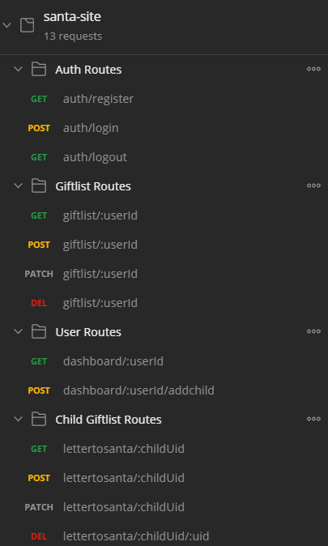

Testing was tracked in an excel spreadsheet. This is attached in the docs folder. If a test failed the bugs were noted down, fixes were also noted after the test changed to passing. We did a lot of manual testing in development which meant that once we moved to production we didn't notice any errors thankfully. Please refer to the excel document testing in the docs folder.
